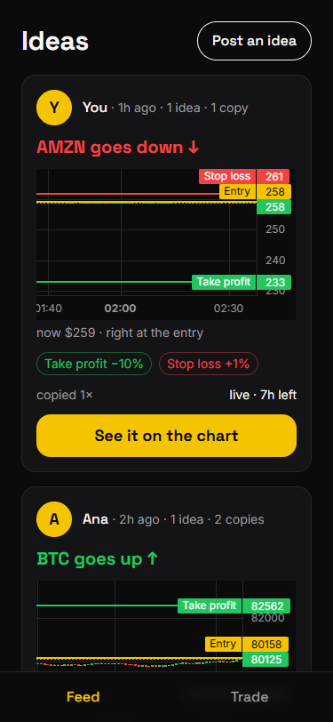
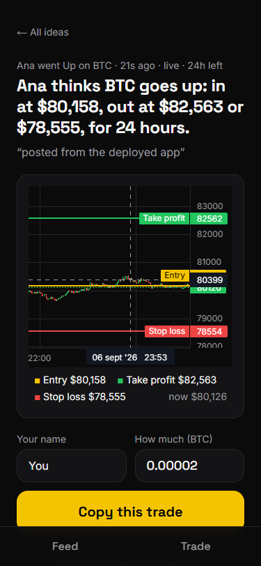
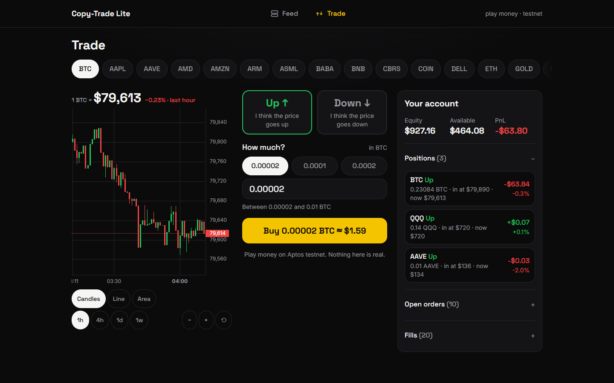

# Copy-Trade Lite

A dead-simple trading app on **Decibel (Aptos testnet)** that a smart 12-year-old could use, with a copy-trade signal feature on top. Built 100% in TypeScript with Next.js. **Testnet only, play money only.**

> **Status:** built change by change with Spec-Driven Development (OpenSpec). The table in [What works today](#what-works-today) is kept honest at every commit.

## Try the deployed demo

**<https://copy-trade-lite-gilt.vercel.app>** — open it on a laptop or on your phone; the layout follows the screen.

- **Browsing is open:** the ideas feed, every idea on its chart, the account card and the live prices need nothing. **Every card in the feed already shows its coin's candles with the Entry, Take profit and Stop loss lines and where the price is now**; "See it on the chart" opens the full-size chart with the copies. None of that needs a code; only the final "Copy this trade" button does.
- **Trading needs the demo code** included in the submission email. The first time you tap the yellow button the app asks for it, remembers it in your browser, and never asks again. Without the code every write route answers `401` and nothing is signed.
- Everything is **play money on Aptos testnet**; the orders it places are real testnet transactions from one shared testnet account.
- The first request after a quiet period can take a few seconds (serverless cold start); after that prices refresh every 5 s and the feed every 10 s.

The demo path is the same as [step 7 below](#run-it-locally): Trade → Buy → see the position → Feed → Post an idea → See it on the chart → Copy it.

## What works today

| Tier | Feature | Status |
|---|---|---|
| — | App shell: validated env + testnet guard, design tokens, base components, two-tab navigation | ✅ Done (`bootstrap-app`) |
| MUST 1 | Connect to Decibel on Aptos testnet and authenticate the account | ✅ Done (`decibel-testnet-connection`) — `pnpm smoke` |
| MUST 2 | Real testnet order with builder codes (approve → place), fee bound enforced | ✅ Done (`decibel-testnet-connection`) — `pnpm approve`, `pnpm order:once` |
| MUST 3 | Kid-friendly trade screen: coin, Up/Down, how much, one button | ✅ Done (`trade-screen`, `trade-chart`) — `/trade`, with the coin's live chart (candles / line / area, 1h–1w, zoom) above the Up/Down choice |
| MUST 4 | Live account: equity, positions + PnL, open orders, fills (5 s polling, honest staleness) | ✅ Done (`trade-screen`) — `/trade` |
| SHOULD 5 | Signal authoring: entry = live price, TP %, SL %, hold duration | ✅ Done (`copy-trade-signals`) — "Post an idea" on `/` |
| SHOULD 6 | Signal on a chart with entry / take-profit / stop-loss lines | ✅ Done (`copy-trade-signals`, `signal-visible-in-feed`, `trade-chart`) — every feed card draws its coin's candles with the three lines and the live price; `/signals/[id]` is the full-size chart with the copies; every chart has the same toolbar (chart type, range 1h · 4h · 1d · 1w, zoom) |
| SHOULD 7 | One-click copy from the copier's own account, builder code attached | ✅ Done (`copy-trade-signals`) — "Copy this trade" |
| SHOULD 8 | Persisted signal history with per-author track record | ✅ Done (`copy-trade-signals`) — libSQL: a local file, or Turso when deployed |
| STRETCH | Mobile-friendly layout | ✅ Done — designed at 375 px first, verified in a real browser |
| Polish | Desktop layout | ✅ Done (`desktop-layout`) — from 1024 px the feed shows the list beside the open idea and Trade becomes a trading desk (coins on top, chart, order ticket, account); the nav moves from the bottom bar to a top bar |
| STRETCH | Outcome marking (hit TP / hit SL / expired) with a per-author record | ✅ Done (`signal-outcomes`) — every idea is settled from its market's candles and the feed shows "✅ It worked", "❌ It didn't work" or "⏱ Time ran out", plus "1 of 2 worked" per author |
| STRETCH | WebSocket, leaderboard page | ⏳ Not done — see [What's next](#whats-next) |
| Delivery | Deployed link with a passcode-gated write path (instead of a recording) | ✅ Done (`deploy-demo`) — [Try the deployed demo](#try-the-deployed-demo) |

Proof on the Aptos testnet explorer: first order from the script `0x5f433998292cf8350bbbb92e52fd334c70e4c92c98132b90caf6f73291f86875`, builder-fee approval `0x0c237551c7a68fad58c6999cc0f883fc78bce6d947cf845f384d34fa5e198f24`, order placed from the Trade screen `0x9e3276151dae78bb1a41e9dd7ae16148a42f90e9bb467df165dd43e51b9cf7af`, **signal copied with one tap** `0x54c0e82a700bec0d4372b0ed6a589c10732f988b5bb306e02abac5acc924dff3`. From the **deployed** app: order `0xf2bcbd0dcdda8466a7abfe501e48f3a41abc58f0685967e89fad7e2a9f49d027`, copy `0x9503723e776d545f5a66b3c24dafb44c5fb9bcffe7c427396c4159ee4232909b`.

<p align="center">
  
  
  <br /><sub>SHOULD 6: every card in the feed draws its coin's candles with the idea's three lines (left); "See it on the chart" opens the full-size chart with the copies and the one-tap copy (right, on the deployed app).</sub>
</p>

<p align="center">
  
  <br /><sub>From 1024 px the same screens use the width: Trade becomes a trading desk (coins, chart, order ticket, account) and the feed shows the list beside the open idea. See <a href="docs/feed-desktop.png">the wide feed</a>.</sub>
</p>

> **Play names, one account.** Authors and copiers are display names typed in the form; every order is signed with the single testnet key in `.env`. There is no login — that is out of scope for this take-home and is called out under [Safety](#safety).

## Prerequisites

- **Node.js 22+** (built on 24) and **pnpm 12** (`npm i -g pnpm`)
- **Git**
- Testnet credentials (below). No mainnet config exists anywhere in this repo.

## Get your credentials (≈10 minutes)

You need three values. Everything else in `.env` has safe defaults.

1. **`PRIVATE_KEY`** — the Ed25519 private key of a **testnet** wallet.
   [app.decibel.trade/api](https://app.decibel.trade/api) → *API Wallet* → copy the private key. Or generate a fresh one with `pnpm keygen` (prints the key once, writes nothing to disk).
2. **`APTOS_NODE_API_KEY`** — a Geomi API key (Aptos Labs infrastructure). Without it every SDK call returns `401`.
   [geomi.dev](https://geomi.dev) → *New Project* (any name) → *API Keys* → *Create New API Key* → **Network: Testnet**, **Client usage: OFF** (the key stays on the server).
3. **`BUILDER_ADDRESS`** — the Decibel **trading subaccount** that receives builder fees. It must be a subaccount, not a plain wallet (the chain aborts with `EBUILDER_SUBACCOUNT_NOT_FOUND` otherwise). The simplest choice is your own primary subaccount, which `pnpm smoke` prints — see step 3 of [Run it locally](#run-it-locally).

Then get testnet **APT for gas**: [aptos.dev/network/faucet](https://aptos.dev/network/faucet) (sign in, Testnet, paste your wallet address, Request). Check it arrived on the explorer: `https://explorer.aptoslabs.com/account/<your-wallet>?network=testnet`.

## Run it locally

```bash
git clone <this repo> copy-trade-lite
cd copy-trade-lite
pnpm install
cp .env.example .env        # Windows PowerShell: Copy-Item .env.example .env
```

1. Open `.env`, fill in `PRIVATE_KEY` and `APTOS_NODE_API_KEY`, and put your **wallet address** in `BUILDER_ADDRESS` for now (any valid hex works to get started). Leave the rest as is:

   ```
   BUILDER_FEE_BPS=10                    # protocol cap; also the per-order fee
   DECIBEL_NETWORK=testnet               # anything else refuses to start
   MAX_ORDER_SIZE=0.01                   # fat-finger cap in base units (BTC)
   DATABASE_URL=file:./data/signals.db   # local SQLite file, created on first use
   DATABASE_AUTH_TOKEN=                  # only for a remote database (see Deploy your own)
   DEMO_PASSCODE=                        # empty locally: no code is asked for
   ```

2. Prove the connection (no transactions):

   ```bash
   pnpm smoke
   ```
   Expected (values will differ):
   ```
   wallet      0xdc47…86cc
   subaccount  0x2cec…dd1e
   builder     0xdc47…86cc  fee 10 bps  max order 0.01
               ⚠ BUILDER_ADDRESS is your wallet; the chain expects a Decibel subaccount. Use the subaccount line above.
   gas         10.0000 APT
   markets     67 open perp markets
     BTC/USD    min 0.00002  tick 1  lot 0.00001  decimals px=6 sz=9
   BTC/USD     mid $79,990.00  mark $79,990.00  oracle $79,989.45
   equity      $0.00  (trading account not created yet — run `pnpm mint` to deposit play money)
   ✓ connection OK
   ```

3. Copy the `subaccount` line into `BUILDER_ADDRESS` in `.env` (the warning disappears on the next `pnpm smoke`).

4. Get play money — mints test USDC through Decibel's testnet faucet function and deposits it into your trading subaccount (2 transactions, needs APT for gas):

   ```bash
   pnpm mint            # default 1000 USDC; the testnet allowance is 1000 per wallet per day
   ```
   ```
   mint allowance  1,000.00 USDC available for this wallet
   minted          1,000.00 USDC  https://explorer.aptoslabs.com/txn/0x…?network=testnet
   deposited       1,000.00 USDC  https://explorer.aptoslabs.com/txn/0x…?network=testnet
   equity now      $1,000.00  (withdrawable $1,000.00)
   ✓ play money ready
   ```

5. Approve the builder fee (step 1 of builder codes; safe to re-run). A fresh database always needs this, even if the wallet approved before: the approval lives on chain, but the record the app checks before signing is a row in the database at `DATABASE_URL`, and the SDK has no call to read the approval back. Skipping it stops the next step with "The builder fee has not been approved yet. Run `pnpm approve` once before trading."

   ```bash
   pnpm approve
   ```
   ```
   approved          10 bps for 0x2cec…dd1e
   transaction       https://explorer.aptoslabs.com/txn/0x…?network=testnet
   recorded in       the database at DATABASE_URL (table builder_approvals)
   ✓ builder fee approved
   ```

6. Place one real order — the minimum BTC/USD size (0.00002 BTC ≈ $1.6), immediate-or-cancel, builder code attached:

   ```bash
   pnpm order:once            # add --sell to go the other way, or a size like 0.00005
   ```
   ```
   Buying 0.00002 BTC on BTC/USD (IOC, builder fee 10 bps)…
   transaction   0x5f43…6875
   explorer      https://explorer.aptoslabs.com/txn/0x5f43…6875?network=testnet
   reference     $79,954.00   limit $80,354.00
   order id      1701…9696
   ✓ order transaction committed
   ```
   Run `pnpm smoke` again: `positions 1` and the fee deducted from *withdrawable*.

7. Start the app and trade from the screen:

   ```bash
   pnpm dev          # http://localhost:3000
   ```

   **Demo path (what a reviewer does first, ~90 seconds).** Use a phone-sized viewport (DevTools → device toolbar → 375 px):

   1. **Trade** tab → BTC is selected, "1 BTC = $80,237 · +0.06% · last hour" and the BTC chart of the last hour are at the top (try **Line**, **1d** or **+** on its toolbar; pinch or scroll also zooms) → tap **Up ↑** → tap the **0.00002** chip. The yellow button reads "Buy 0.00002 BTC ≈ $1.60" and is visible without scrolling on a 375 × 812 phone.
   2. Tap it once → "Sending your order…" → green toast **See it on the explorer** (testnet transaction, status Success) → scroll to **Your account**: Equity, Available, PnL and the position with PnL in $ and %.
   3. **Feed** tab → **Post an idea**: your name, BTC, **Up**, take profit 3 %, stop loss 2 %, hold 4 hours. The entry is the live price, read on the server; the dollar previews follow what you type. Tap **Post this idea**.
   4. The new card is first in the feed: "BTC goes up ↑", the BTC candles of the last hour with the **Entry**, **Take profit** and **Stop loss** lines, "now $… · right at the entry", "live · 4h left · copied 0×". Tap the yellow **See it on the chart**.
   5. The full-size chart: the same three lines, the live price, and the copies. Type a different name and tap **Copy this trade** once → toast with the explorer link → a marker appears on the chart and the count becomes "Copied 1×".
   6. Back on **Feed**, the card says "copied 1×" and the author line shows "1 idea · 1 copy". On **Trade**, the position grew.
   7. Leave it running. When the price reaches the take profit or the stop loss — or when the hold ends — the card says **"✅ It worked"**, **"❌ It didn't work"** or **"⏱ Time ran out"**, the author line gains "1 of 1 worked", and the idea can no longer be copied. To see it in a minute, post an idea with a take profit of `0.01` %.

   The first request after `pnpm dev` compiles the routes and can take ~8 s; after that the price and account refresh every 5 s and the feed every 10 s.

> **What protects the deployed app.** One testnet key signs every order, server-side. On the public URL the three routes that can sign or write (`POST /api/order`, `POST /api/signals`, `POST /api/signals/[id]/copy`) require the demo code in an `x-demo-passcode` header and answer `401` without it, before the body is even parsed; reads stay open. The key never leaves the server (`server-only` modules), the network guard refuses anything but testnet, `MAX_ORDER_SIZE` caps each order, and the builder-fee bound is asserted immediately before signing. The code is a demo gate, not a login — see [Safety](#safety) and the [biggest-risk note](#biggest-risk-in-this-submission). Locally, with `DEMO_PASSCODE` empty, nothing asks for a code.

## Deploy your own

The app runs on any Node host. It was deployed on Vercel with a Turso database, both on free plans:

1. **Database.** Create a Turso database (`turso db create copy-trade-lite`), then take its URL (`turso db show copy-trade-lite --url`) and a token (`turso db tokens create copy-trade-lite`). A serverless filesystem is discarded between invocations, which is why the local `file:` database cannot be used there.
2. **Approve from your machine.** Put the URL and token into your local `.env` as `DATABASE_URL` / `DATABASE_AUTH_TOKEN` and run `pnpm approve` once: the approval record is written to that database, where the deployment will read it.
3. **Vercel.** Import the repository (Next.js defaults) and set the environment variables: `PRIVATE_KEY`, `APTOS_NODE_API_KEY`, `BUILDER_ADDRESS`, `BUILDER_FEE_BPS`, `DECIBEL_NETWORK=testnet`, `MAX_ORDER_SIZE`, `DATABASE_URL`, `DATABASE_AUTH_TOKEN` and a `DEMO_PASSCODE` of your choosing. Deploy; the schema is created on the first request.
4. Share the URL freely and the code only with whoever should be able to trade. Rotate the code by changing the variable and redeploying.

## Manual test checklist (current state)

**Connection and orders (scripts):**

| Command | Expect |
|---|---|
| `pnpm smoke` with a wrong `APTOS_NODE_API_KEY` | exit 1: `Your Geomi API key was rejected. Create a Testnet key at https://geomi.dev …`, no stack trace, no secret printed |
| `pnpm mint 999999` | exit 1 **before any transaction**: allowance message with the reset time |
| `pnpm order:once 0` / `pnpm order:once 5` / `pnpm order:once abc` | exit 1, no transaction: `… choose an amount between 0.00002 and 0.01 BTC` |
| Approve 5 bps then order with 10 bps: `BUILDER_FEE_BPS=5 pnpm approve` (PowerShell: `$env:BUILDER_FEE_BPS=5; pnpm approve`), then `pnpm order:once` | exit 1, no transaction: `Builder fee 10 bps exceeds the approved maximum of 5 bps …`. Restore with `pnpm approve`. |
| `pnpm approve` twice | both succeed; second run shows "already approved" and re-approves |

**Environment guard** (the app and every script must refuse to start on a bad config):

| Change in `.env` | Expect |
|---|---|
| `DECIBEL_NETWORK=mainnet` | `DECIBEL_NETWORK must be exactly "testnet" — mainnet is never allowed` |
| `BUILDER_FEE_BPS=11` | `BUILDER_FEE_BPS must be between 0 and 10 basis points (protocol cap)` |
| `PRIVATE_KEY=` (empty) | `PRIVATE_KEY is required …`; no secret value is printed |

**Trade screen** (`pnpm dev`, phone-sized viewport, 375 px, <http://localhost:3000/trade>):

- [ ] Default: BTC selected, Up selected, first chip selected, "1 BTC = $…" shows a price with the change over the last hour, the BTC chart renders with **Candles · 1h**, yellow button enabled with size and ≈ dollar value and visible without scrolling at 375 × 812. No trading jargon anywhere.
- [ ] Tap **AAVE** → the price and the chart switch to AAVE with the same chart type and range; the coin row fades at its right edge to show it scrolls.
- [ ] Tap **Line**, then **1d** → a line over the last day of 15-minute points; the change figure now says "· last day"; reload → still Line. Tap **+** twice → fewer bars on screen each time; **⟲** shows the whole range again.
- [ ] Tap **Down ↓** and the third chip → button reads "Sell 0.0002 BTC ≈ $…"; nothing is sent until you tap it.
- [ ] Type `0` or `5` in the box → button disabled, red hint "Choose an amount between 0.00002 and 0.01 BTC".
- [ ] Tap the yellow button once → "Sending your order…", then a green toast with **See it on the explorer** (opens a successful testnet transaction); within 10 s the position in **Your account** updates.
- [ ] Tap the yellow button twice quickly → only one order is sent (the button is disabled while sending).
- [ ] Turn off Wi-Fi (or block `/api/account` in DevTools) → the account numbers stay and a "couldn't refresh" chip appears; turn it back on → the chip disappears.
- [ ] Empty account (fresh key, no mint): the card shows $0.00 and "No trades yet — try Up on BTC"; placing an order shows the plain-language "Not enough play money — run `pnpm mint`" toast.

**Ideas, chart and copy** (`/` and `/signals/[id]`, 375 px):

- [ ] Empty database → the feed says "No ideas yet — post the first one" with the Post an idea action visible.
- [ ] In **Post an idea**, change take profit from 3 to 5 → the "out at $…" preview updates without submitting. Entry is read-only.
- [ ] Enter take profit `0` and post → error toast "Take profit must be more than 0%", the sheet stays open with your inputs.
- [ ] Post a valid idea → toast, sheet closes, card first in the feed with "live · Xh left", its coin's candles with the three lines and a sentence such as "now $… · right at the entry"; pinch or scroll on the card's chart zooms it.
- [ ] Two ideas on different coins → each card shows its own coin's candles and levels.
- [ ] Tap **See it on the chart** → the full-size chart with three labeled lines at the entry, take-profit and stop-loss prices, plus the plain-language sentence; copies made within ten minutes of each other share one marker ("Ben, Cid copied").
- [ ] Tap **Copy this trade** once → busy label → toast with an explorer link → marker on the chart, "Copied 1×", copier listed.
- [ ] Tap it twice quickly → only one order is placed.
- [ ] Restart `pnpm dev` → the ideas and copies are still there (the database at `DATABASE_URL`).
- [ ] An expired idea shows "expired" on the card and a disabled "This idea has expired" button on its detail.

**Demo passcode** (set `DEMO_PASSCODE=something` in `.env`, restart `pnpm dev`):

- [ ] Feed, idea detail and Trade all load without a code.
- [ ] First tap on **Buy** → sheet "Enter the demo code". A wrong code → "That code wasn't accepted…" and the field is cleared. The right code → the order goes through; a second tap does not ask again.
- [ ] `curl -X POST localhost:3000/api/order -H "content-type: application/json" -d '{"market":"BTC/USD","side":"up","size":0.00002}'` → `401 DEMO_CODE_REQUIRED`, no transaction; add `-H "x-demo-passcode: something"` → 200.
- [ ] The value never appears in the page source or in any response.

**API contract** (with the dev server running):

| Request | Expect |
|---|---|
| `curl localhost:3000/api/markets` | `ok:true`, BTC/USD first with `minSize 0.00002`; only markets whose minimum fits under `MAX_ORDER_SIZE` are listed |
| `curl localhost:3000/api/price/FOO%2FUSD` | 422 `UNKNOWN_MARKET` |
| `curl "localhost:3000/api/candles/BTC%2FUSD?range=1w"` | 200 with about 168 ascending hourly candles and `interval: "1h"`; `range=1h` → ~60 one-minute candles; `range=3y` → 422 "Choose a range of 1h, 4h, 1d or 1w."; unknown market → 422 `UNKNOWN_MARKET` |
| `curl -X POST localhost:3000/api/order -H "content-type: application/json" -d '{"market":"BTC/USD","side":"up","size":"abc"}'` | 422 `INVALID_SIZE` with the allowed range |
| … `-d '{"market":"BTC/USD","side":"up","size":0.00002,"builderFee":1}'` | 422 `INVALID_INPUT` "Unexpected field: builderFee." (same for `price`, `builderAddr`) |
| … `-d '{not json'` | 400 `BAD_JSON` |
| `curl -X POST localhost:3000/api/signals -H "content-type: application/json" -d '{"author":"Ana","market":"BTC/USD","side":"up","tpPct":3,"slPct":2,"holdHours":4,"size":0.00002}'` | 200 with `entryPrice` from the live mid and `tpPrice ≈ entry × 1.03` |
| … with `"entryPrice":1` added | 422 "Unexpected field: entryPrice." (the client can never set the entry) |
| … with `"tpPct":0` / `"holdHours":1000` | 422 with the plain-language range |
| `curl localhost:3000/api/signals` | `prices` and `candles` (about 60 one-minute candles) for every market that has a live idea; a market the exchange cannot quote is simply absent |
| `curl localhost:3000/api/signals/nope` | 404 `NOT_FOUND` |
| `curl -X POST localhost:3000/api/signals/<expired-id>/copy -d '{"copier":"Ben"}'` | 422 `SIGNAL_EXPIRED`, no order placed |

**Shell and navigation**:

- [ ] `/` shows the yellow headline in Space Grotesk on black; no other saturated color.
- [ ] Tap **Trade** → `/trade`, tab turns yellow; tap **Feed** → back.
- [ ] At 375 px the nav is an opaque bar at the bottom with an icon and a label per tab; nothing behind it shows through.
- [ ] At 1280 px the nav is a top bar with the wordmark and "play money · testnet"; `/` shows the ideas list beside the open idea's chart and copy panel, and the only yellow action is **Copy this trade**; `/trade` shows coins across the top, the chart on the left, the ticket beside it and the account on the right, all without scrolling.
- [ ] At 1280 px **Post an idea** opens as a centered dialog; at 375 px it still slides up from the bottom.

**Quality gates:**

```bash
pnpm typecheck   # tsc --noEmit, strict
pnpm lint        # eslint
pnpm test        # vitest: chain units, order safety checks, repo, api, passcode gate (93 tests, no network)
pnpm build       # production build; must succeed
```

**Server-only boundary (optional):** add `import { env } from "@/lib/env";` to `components/AppNav.tsx` and run `pnpm build`. It must fail with `You're importing a module that depends on "server-only"`. Remove the line; the build passes again.

## Project structure

```
app/                    Next.js App Router: layout, feed (/), /trade, /signals/[id]
app/api/                markets, price/[market], candles/[market]?range=, account, order, signals, signals/[id], signals/[id]/copy — every route goes through apiHandler
components/             shell (BigButton, Card, Sheet, Toast, AppNav — bottom bar on phones, top bar on wide screens), trading (CoinPills, MarketPanel with the price hero and chart, TradeForm as the order ticket, SideToggle, SizePicker, AccountCard, TradeScreen laying the four panels out), signals (Feed, SignalCard, IdeaStrip fallback, PostIdeaSheet, SignalDetail, CopyPanel, DetailRail / FeedRail for the wide second column), MarketChart / MarketChartInner (lightweight-charts with the type · range · zoom toolbar, used by all three)
hooks/useMediaQuery.ts  the one breakpoint hook (useSyncExternalStore, server snapshot false) for the few places CSS cannot decide
lib/charts.ts           range → candle interval, range change, plain-language range labels (tests)
hooks/usePoll.ts        polling with last-good-data + stale flag, fetch/post envelope helpers (tests)
hooks/useDemoPasscode.ts  sends the stored demo code, asks for it on a 401 and retries (PasscodeSheet)
lib/auth.ts             assertDemoAccess: constant-time header check, no-op when DEMO_PASSCODE is empty (tests)
lib/signals/db.ts       libSQL client at DATABASE_URL (file locally, Turso deployed), schema created once per process
lib/signals/repo.ts     parameterised statements, zod-parsed rows, copy counts and author stats (tests)
lib/signals/feed.ts     the one feed loader: signals, author stats, live prices and last-hour candles per market
lib/signals/math.ts     TP/SL prices, expiry, plain-language wording, strip geometry, marker clustering (tests)
lib/signals/outcome.ts  settleSignal (pure: candles + levels → tp/sl/expired), settleAll (one read per market), plain badges (tests)
lib/schemas.ts          zod OrderInput (.strict()) + shared response types (client-safe)
lib/api.ts              apiHandler: guard before parsing, one envelope, 401/404/422/400 readable errors, safe 502 (tests)
lib/format.ts           money, amount, pct, timeAgo (client-safe)
lib/env.schema.ts       zod schema + loadEnv() (used by next.config.ts and scripts)
lib/env.ts              server-only frozen env for app code
lib/decibel/client.ts   SDK clients built once from env (TESTNET_CONFIG only), wallet/subaccount/builder
lib/decibel/units.ts    chain-unit math: tick/lot rounding, size bounds (tests)
lib/decibel/orders.ts   approveBuilderFee (record in the database), placeMarketOrder with the fee bound asserted last (tests)
lib/decibel/account.ts  one-call account state with per-position PnL (tests)
lib/decibel/markets.ts  tradable markets (human units) and live price
lib/decibel/errors.ts   TradeError + plain-language mapping of SDK/chain errors
lib/decibel/index.ts    server-only gate: the only import path for app code
scripts/                keygen, smoke, mint-usdc, approve-builder, order-once (tsx)
specs/constitution.md   Non-negotiable rules with executable checks
openspec/               SDD artifacts: config, active changes, archive (process evidence; *.old = previous versions)
data/                   gitignored: the local signals.db (ideas, copies, builder approval)
```

## Safety

Graded explicitly by the brief; enforced in code, not by convention:

- **Testnet only** — `TESTNET_CONFIG` is the only Decibel config imported (`lib/decibel/client.ts`); `DECIBEL_NETWORK` must equal `testnet` or the process exits (`lib/env.schema.ts`, run from `next.config.ts` and every script).
- **No secrets in the repo** — `.env*` and `data/` are gitignored since the first commit; `.env.example` has no real values; scripts never print keys.
- **Secrets never reach the browser** — `lib/env.ts` and `lib/decibel/index.ts` import `server-only`; a client component importing them breaks the build (verified).
- **Writes are gated on the public URL** — `assertDemoAccess` (`lib/auth.ts`) runs before the body of `POST /api/order`, `POST /api/signals` and `POST /api/signals/[id]/copy` is read; without the `x-demo-passcode` header the answer is `401` and nothing is signed. Constant-time compare; the expected value is never in a response, a log or the client bundle (checked on the live deployment). With `DEMO_PASSCODE` empty the routes behave as before, so a local clone needs no code.
- **Builder fee bound** — the fee is a server constant (`BUILDER_FEE_BPS`, validated `0..10` at startup); no function takes a fee parameter; `assertFeeBound` checks `fee ≤ approved max ≤ 10` immediately before the transaction is built, against the approval `pnpm approve` recorded in the database.
- **Validate before signing** — `toValidOrderSize` (finite, > 0, ≥ market minimum, ≤ `MAX_ORDER_SIZE`) and `assertTpSlSides` run before any pricing or signing; every rejection is a plain-language message with the allowed range.
- **One validated boundary** — `POST /api/order` and `POST /api/signals/[id]/copy` are the only ways an order enters; both bodies are `.strict()` zod schemas (coin, direction, size, names — nothing else) and both call the same `placeMarketOrder`. A copy cannot choose the price, the builder address, the fee or the exit levels: they come from the stored signal and the server constants. Errors never expose stacks, URLs or keys (`lib/api.ts`, tested).
- **The entry price is a server fact** — `POST /api/signals` reads the live mid itself; `SignalInput` has no `entryPrice` field and `.strict()` rejects one (tested).
- **Honest about outcomes** — an idea is settled from its market's candles, not from fills, so an idea nobody copied is judged by the same rule as one copied ten times. When a single candle reached **both** levels, the order of the two moves inside it is unknowable and the app records the **stop loss**: it never claims a win the data cannot support. Once written, an outcome is never recomputed.
- **Honest about fills** — an immediate-or-cancel order can be sent without filling, so copies record the reference price and the UI says "at about $…"; the receipt reports `tpSlAttached: false` if the exchange ever refuses the exit levels. A copy whose order succeeded is never reported as a failure, even if writing it to the database fails (that case is logged loudly).
- **The database holds no secrets** — ideas, copies and the builder-approval record (addresses, a fee cap and a public transaction hash). If it is unreachable the feed says so in plain words and the Trade screen keeps working; orders never touch it.
- **Unhappy paths** — every SDK/chain error becomes a `TradeError` with a readable message and the original error kept on `cause`; success is never reported without a transaction hash; an empty account (404 before the first deposit) is a state, not an error.

## What's next

With another day, in this order:

1. **Real-time updates**: an SSE route forwarding the SDK's price and position subscriptions, with the current polling kept as the fallback — so an outcome appears the moment it happens instead of on the next 10-second poll.
2. **A leaderboard page** from the author record already computed (`ideas`, `copies`, `settled`, `won`), with a third navigation tab.
3. **Wallet-based signing** so each person copies from their own wallet instead of the shared server key — the change that removes the biggest risk below.

### Biggest risk in this submission

One testnet private key lives on the server and signs every order, so anyone who can call the write routes of the public URL could spend the shared testnet balance. It is mitigated by a demo passcode checked before the body of those routes is read (`401` without it, reads stay open), by `server-only` modules that keep the key out of the browser (the live bundle was scanned: no key, token or code), by an environment guard that refuses anything but testnet, by a per-order size cap, and by the builder-fee bound asserted immediately before signing. A shared code is a demo gate, not authentication: the real fix is wallet-based signing in the browser, so each person copies from their own account and the server never holds a key.

The same note, with the enforcement points and how each was verified, is in [`docs/SAFETY_REVIEW.md`](docs/SAFETY_REVIEW.md).


## AI-generated vs. what I changed after reviewing it

Nearly all of the code here was drafted by an AI agent working against written specs, and then reviewed line by line before each commit. The repository carries the evidence: `openspec/changes/archive/` holds what was planned **before** any code existed, the `*.old` files next to each design hold the versions that reality forced me to correct, and the review pass after every change is a separate `fix:` commit.

What the review actually caught — these are the changes I made to the generated code, not a list of what it wrote:

- **A regex that would have placed a second real order.** The copy route retried without take-profit/stop-loss when the chain "blamed the trigger prices", detected with `/tp|sl|trigger/`. `tp` matches inside `http`, and SDK errors carry URLs, so almost any rejection would have triggered a second order. Fixed with patterns anchored to whole Move identifiers, plus a test whose failing case is literally "the message contains a URL".
- **The same class of bug, earlier.** `humanizeSdkError` classified an error as "API key rejected" because it found `401` **inside a hex package address**. Fixed with word boundaries and a Move-abort reason extractor. Two instances of the same mistake is why I now distrust substring matching over free text.
- **A wrong assumption about builder codes.** The plan said `BUILDER_ADDRESS` could be any address I control. The chain answered `EBUILDER_SUBACCOUNT_NOT_FOUND`: it must be a Decibel *subaccount*. `.env.example`, the README and a warning in `pnpm smoke` were updated.
- **A dependency that would have broken a fresh clone.** `better-sqlite3` has no prebuilt binary for Node 24 here and `node-gyp` needs a C++ toolchain. Replaced with Node's built-in `node:sqlite`, verified inside a Turbopack route handler before writing the persistence layer.
- **Markets nobody could trade.** `MAX_ORDER_SIZE` is one cap in base units, so coins whose minimum order is larger (ADA, WLFI) showed an impossible range like "between 5 and 0.01 ADA". The list now only offers what this app can actually trade.
- **An impure render and a cascading effect**, both flagged by React's compiler rules: `Date.now()` inside a component, and a `setState` in the polling hook's effect. The clock moved out of render and the hook now derives its reset from the URL it belongs to.
- **Accessibility the draft ignored:** a closed bottom sheet still reachable by Tab (fixed with `inert`), toast timers left running after unmount, tap targets under 44 px, and a coin selector that forced 36 tab stops before the main button (fixed with the ARIA roving-tabindex pattern).
- **Two honesty fixes.** A copy stores the *reference* price, not a confirmed fill, so the interface says "at about $…"; and a spec scenario used `DOGE/USD` as a market that "does not exist" — it does exist on testnet, so the scenario was corrected rather than left to pass by luck.
- **A deploy that could not sign.** The first deployment refused every order with `FEE_BOUND`: the approval record `pnpm approve` writes was a gitignored local file, which a serverless host never has. The plan had not seen it because the local file was always there. The record moved into the database (design D7 of `deploy-demo`), and the agent's first reading of the result — "fills went up, so the order went through" — was wrong too: the extra fill was a local one. The deployed order was only counted as proof once the network log showed the `200` and the explorer link.
- **A chart nobody found.** A reviewer's first comment was "I think you missed *visualise a signal on the chart*". The chart existed, one tap away — behind a card button labelled "Copy", which reads as "trade now" and, on the public URL, as "needs the code". The feed now shows every idea on its coin's own candles, and the button says where it goes. Two drafts of that card were thrown away the same hour: a level strip and a hand-drawn SVG line, both replaced by the real chart because a reviewer expects the chart, not a picture of one (`signal-visible-in-feed`, `design.md.old` and `.old2`).
- **A desktop layout that repeated the same mistake, twice.** The first wide Trade design put the chart inside the form beside the account card; measured at 1280 × 800, the yellow button landed at **908 px** — below the fold, worse than on a phone. Rebuilt as a trading desk (coins on top, chart, order ticket, account) it measures 572. Then the walkthrough caught two more: the wide feed had *two* kinds of yellow action, and the tab order ran chart-then-ticket while the eye read ticket-then-chart. Fixed by making the card action secondary only on wide screens and by putting the chart on the left — which also removed every CSS `order` class, so the DOM, the layout and the keyboard now agree at any width.
- **A layout that only fit on paper.** The design for the Trade-screen chart said "160 px keeps the yellow button above the fold, ≈ 740 by arithmetic". The browser measured 868. Ten toolbar controls need two rows at 375 px, so the chart became 110 px, the hero one line and the gaps 16 px, and the number in the design is now the measured one (732), with the previous version kept as `design.md.old`.
- **Chart labels that hid their names.** Turning off the axis label on a card's level line also removed its title in lightweight-charts, so the first version of the cards drew unlabeled lines; the fix was a small collision rule (the nearest label gives way, the entry and the live price always win) rather than hiding anything.
- **A gate that ran too late.** Task 2.2 said to call `assertDemoAccess` as the first statement of each write route; inside `apiHandler` that would have run *after* the body was parsed. The wrapper gained a `guard` that runs before anything is read, so a refused request never reaches the schema, the SDK or the database.

Two decisions I overrode after seeing the result: the size range stays out of the request schema (so every rejection quotes the same allowed range, from one place in the domain), and a list may repeat its primary action once per card — the constitution now says so explicitly instead of the code quietly breaking the old wording.

## Development process

Each feature is an OpenSpec change (`openspec/changes/<name>/`) with a proposal, a delta spec, a design and a task list; tasks are implemented one by one, each with its own verification and commit, then the change is reviewed against `specs/constitution.md` and archived. When a design decision changes during implementation, the previous artifact is kept next to it as `*.old`. The archive folder is the record of what was planned, what was built and what changed after review.

Ten changes, in order: `bootstrap-app` → `decibel-testnet-connection` → `trade-screen` → `copy-trade-signals` → `polish-and-delivery` → `refresh-app-shell-spec` → `deploy-demo` → `signal-visible-in-feed` → `trade-chart` → `desktop-layout`. `specs/constitution.md` holds the rules every one of them was checked against, each written as something you can actually run.

The safety review is in [`docs/SAFETY_REVIEW.md`](docs/SAFETY_REVIEW.md): every rule the brief grades, mapped to the file that enforces it and the check that was run, with the observed output.

## Scripts

| Command | What it does |
|---|---|
| `pnpm dev` | Dev server on <http://localhost:3000> |
| `pnpm build` / `pnpm start` | Production build / serve |
| `pnpm typecheck` / `pnpm lint` / `pnpm test` | Quality gates |
| `pnpm keygen` | New testnet account (prints the key once) |
| `pnpm smoke` | Connection check: wallet, subaccount, gas, markets, BTC mid, equity |
| `pnpm mint [amount]` | Mint test USDC (testnet faucet function) and deposit it |
| `pnpm approve` | Approve the builder fee (one-time, idempotent) and record it in the database |
| `pnpm order:once [size] [--sell]` | Place one real market order with the builder code |

Deleting `data/signals.db` resets the local idea history **and** the builder-approval record; run `pnpm approve` again after that.

Add `--verbose` to any script to see the underlying error.
